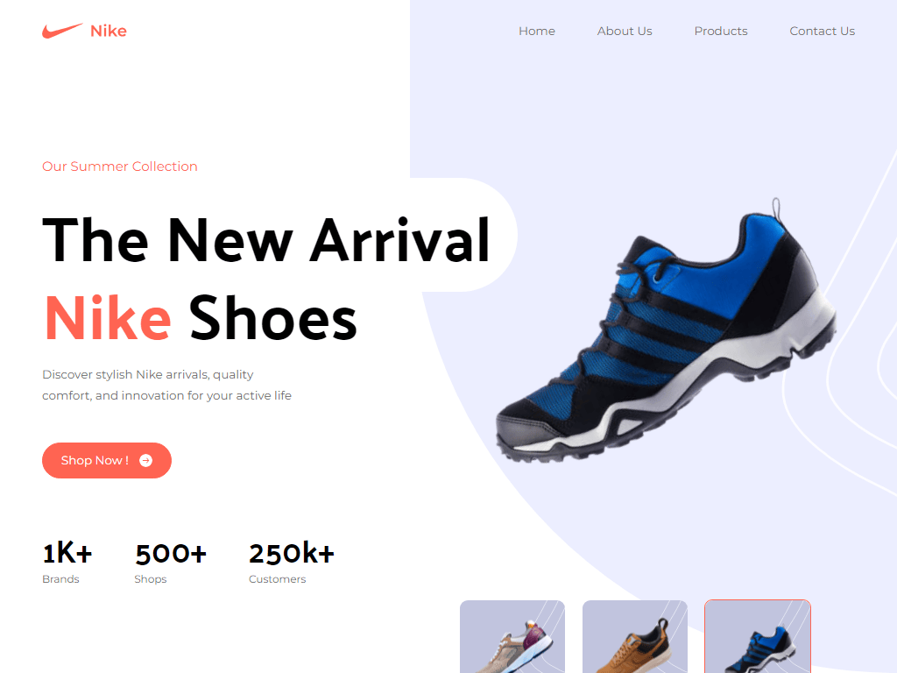
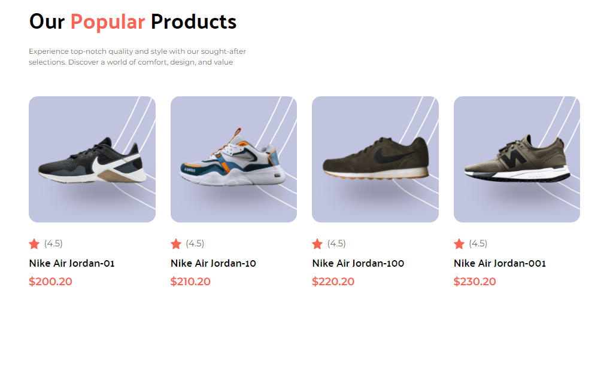
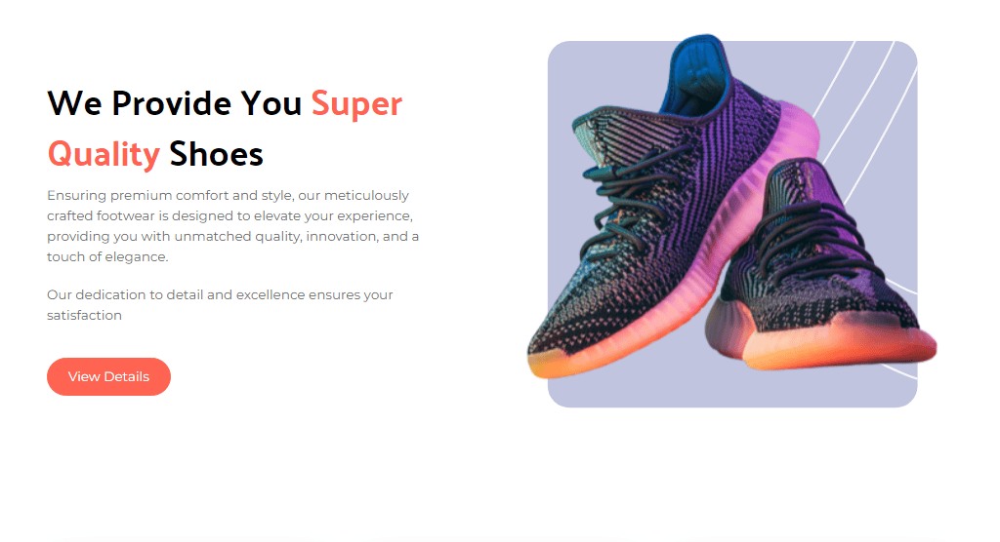
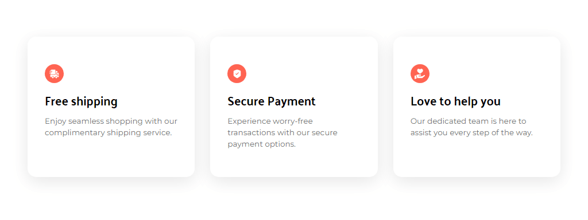
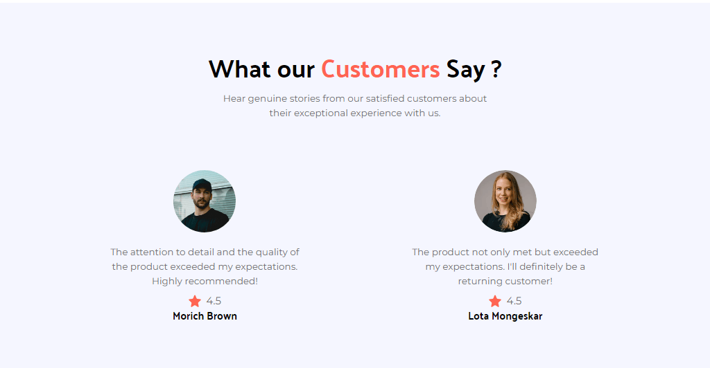
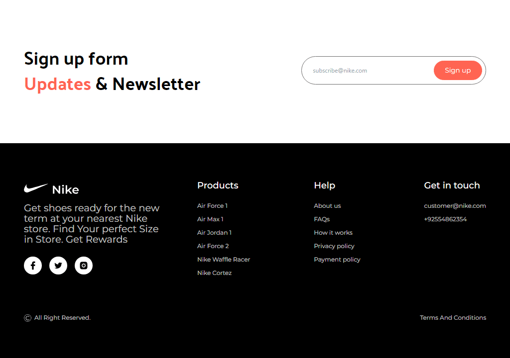
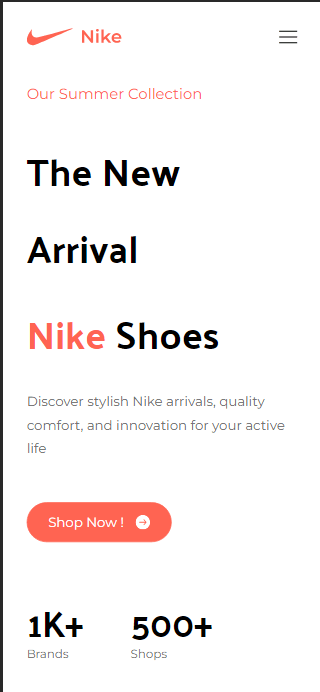

# 👟 Nike

### a Responsive Nike Website

## Link 🔗 [https://charactermi.github.io/nike-website](https://charactermi.github.io/nike-website)

 

# Preview

 

# Mobile Responsive

# Technologies

<ul>
    <li>
        
    </li>
    <li>
        
    </li>
    <li>
        
    </li>
    <li>
        
    </li>
    <li>
        
    </li>
</ul>
